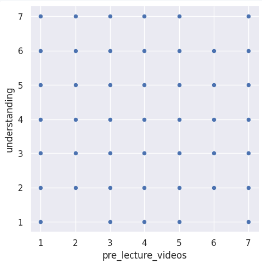
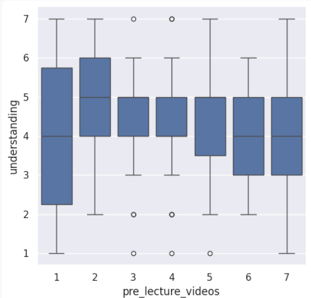
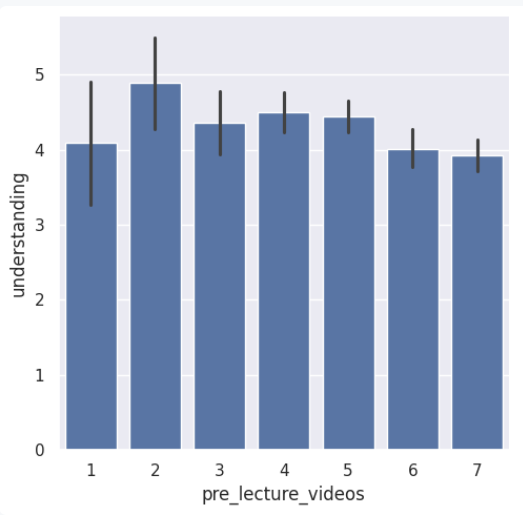

---
# Do not edit the text between these lines!
layout: default
---

# This is a big header

Introduction:

For this project, the chosen idea to analyze with the available data was that this course should include optional pre-recorded lecture videos because they will help increase understanding and retention of complex topics for students taking Comp 110 for the first time. I believe this idea is more valuable than the others brainstormed because: This idea is more valuable than my other brainstormed ideas because if proven to have a positive correlation, this could easily be implemented and will likely have an immediate impact on students in the class.

Analysis:

For the analysis section, I started by loading the data set, so I could begin the analysis. I converted the data using the columnar function and checked the structure of the first few rows utilizing the head function. I then used the selection function to isolate the pre-recorded lecture data and the survey understanding data. Before moving into the visualization section, I used the convert-column-to-int function so they were in the correct format for seaborn. 

For my first visualization, I will utilize a scatterplot to help visually represent the relationship between pre-lecture video usefulness and student understanding.

For my second visualization, I thought a box plot could be helpful to see how the different levels of pre-recorded lecture rating contribute to the level of understanding.

For my final visualization I decided to do a bar plot because I thought it would be the most helpful in explaining averages and would be easier to interperate.

Conclusion: 

Out of the three visual analysis aids I conducted, I think the one with the most conclusive or interpretable results would be the bar chart. The bar chart shows that average student understanding does not consistently increase as students rate pre-lecture videos as more helpful. While some mid-range values show slightly higher averages, the overall trend is not strongly positive. This indicates a lack of a clear association between students' perceptions of pre-lecture videos and their understanding. I believe the box plot and scatterplot only further support this, though the interpretation of these visualizations is more complex and less intuitive. From my understanding of the box plot, given the significant overlap in ratings for or against pre-recorded lecture videos, there isn't much association. Moreover, the results from the scatterplot further demonstrate this, highlighting that there is no clear pattern or trend in the data. This lack of structure further indicates that there is not a strong relationship between the perceived usefulness of pre-lecture videos and student comprehension. 

Overall, the data does not strongly support the idea that pre-lecture videos significantly improve student understanding. As a result, I would not recommend making pre-recorded lecture videos a required component of the course. However, offering them as an optional resource could still provide value, particularly for students who expressed a strong interest in them. While these videos may not substantially improve overall comprehension, they could enhance accessibility and student comfort. There are still important trade-offs to consider. For students, these videos create additional learning resources. However, for instructors and teaching staff, producing high-quality pre-recorded content requires a significant investment of time and effort, which, as the data suggest, might not yield ideal results. For future research, it would be beneficial to collect data on how frequently students actually use pre-recorded videos, rather than only their perception of usefulness. This would allow for a more accurate analysis of whether engagement with these resources has a meaningful impact on student understanding.